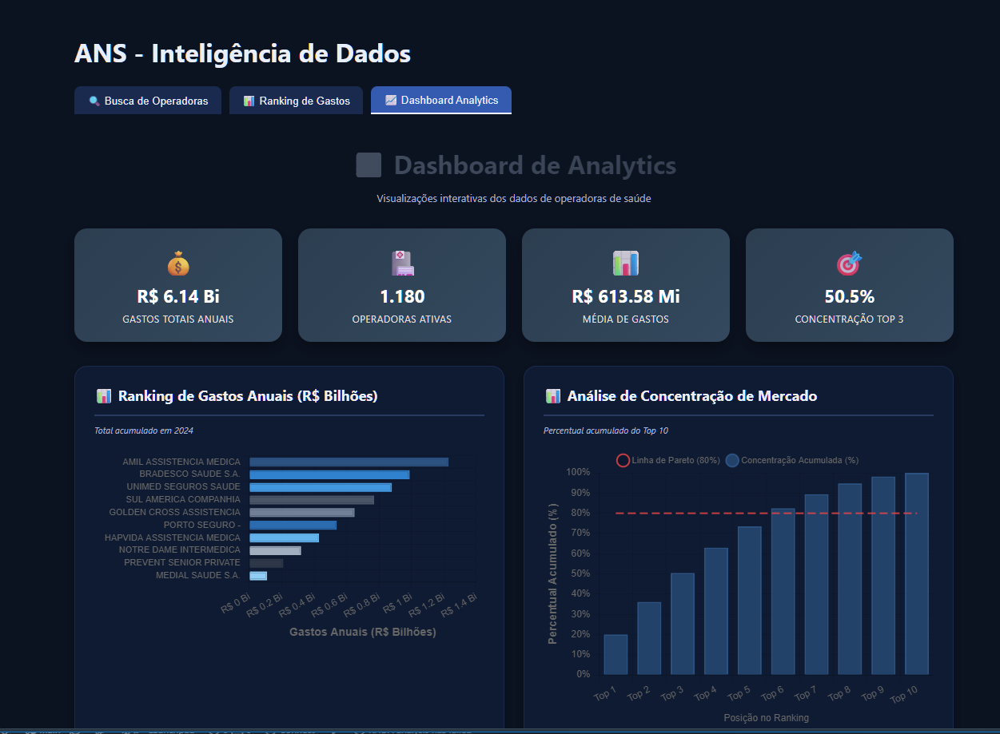
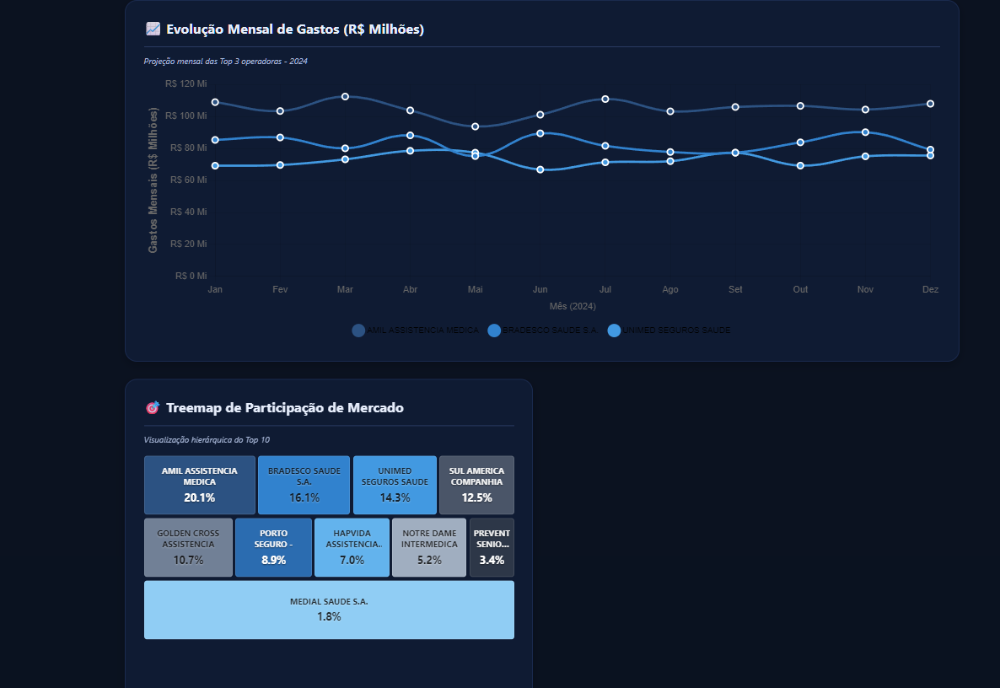

# ANS Intelligence

Aplicação full-stack de Business Intelligence para dados da Agência Nacional de Saúde Suplementar (ANS). Permite buscar operadoras de saúde, analisar gastos assistenciais e visualizar a concentração de mercado através de um dashboard interativo.

---

## Screenshots





---

## Tecnologias

### Backend

| Tecnologia | Versão | Uso |
|---|---|---|
| Python | 3.11+ | Linguagem principal |
| FastAPI | 0.100+ | Framework REST API |
| Pydantic | 2.x | Validação e serialização de dados |
| Pandas | 2.x | Processamento de dados CSV |
| Redis | 7 | Cache em memória |
| MySQL | 8.0 | Banco de dados relacional |

### Frontend

| Tecnologia | Versão | Uso |
|---|---|---|
| Vue.js | 3 | Framework reativo (Composition API) |
| Vite | 4+ | Build tool e dev server |
| Chart.js | 4 | Gráficos interativos |
| vue-chartjs | 5 | Wrapper Vue para Chart.js |

### ETL

| Tecnologia | Uso |
|---|---|
| BeautifulSoup4 | Web scraping do portal ANS |
| Tabula-py | Extração de tabelas de PDFs |
| Requests | Download de arquivos |

### Infraestrutura

| Tecnologia | Uso |
|---|---|
| Docker Compose | Orquestração de containers |
| Uvicorn | ASGI server para FastAPI |

---

## Funcionalidades

**Busca de Operadoras**
- Busca por registro ANS, CNPJ, razão social ou nome fantasia
- Normalização Unicode para buscas sem acento
- Paginação com metadata

**Ranking de Gastos**
- Top 10 operadoras com maiores gastos assistenciais em 2024
- Barras de progresso relativas ao líder

**Dashboard Analytics**
- Ranking de gastos anuais em R$ Bilhões (barras horizontais)
- Análise de concentração de mercado com linha de Pareto (80%)
- Evolução mensal das Top 3 operadoras em R$ Milhões
- Treemap de participação de mercado com contraste automático
- KPI cards: gastos totais, operadoras ativas, média e concentração Top 3

---

## Quick Start

### Pré-requisitos

- Python 3.11+
- Node.js 18+
- Docker e Docker Compose

### 1. Configurar ambiente

```bash
cp .env.example .env
python -m venv .venv

# Windows
.venv\Scripts\activate
# Linux/Mac
source .venv/bin/activate

pip install -r requirements.txt
```

### 2. Subir infraestrutura

```bash
cd docker && docker-compose up -d
```py 

### 3. Iniciar backend

```bash
python -m uvicorn api.main:app --reload
```

### 4. Iniciar frontend

```bash
cd frontend/vue-app
npm install
npm run dev
```

| Serviço | URL |
|---|---|
| Frontend | http://localhost:5173 |
| Backend | http://localhost:8000 |
| Swagger UI | http://localhost:8000/api/v1/docs |
| ReDoc | http://localhost:8000/api/v1/redoc |

---

## API

### Busca de operadoras

```http
GET /api/v1/operadoras?q={query}&page={page}&limit={limit}
```

```json
{
  "query": "amil",
  "results": [
    {
      "registro_ans": "326305",
      "cnpj": "29309127000187",
      "razao_social": "AMIL ASSISTENCIA MEDICA INTERNACIONAL S.A.",
      "nome_fantasia": "AMIL",
      "modalidade": "Medicina de Grupo"
    }
  ],
  "metadata": { "page": 1, "limit": 50, "total": 1, "pages": 1 }
}
```

### Ranking de gastos

```http
GET /api/v1/analytics/gastos?periodo=2024&top=10
```

```json
{
  "periodo": "2024",
  "ranking": [
    {
      "posicao": 1,
      "razao_social": "AMIL ASSISTENCIA MEDICA INTERNACIONAL S.A.",
      "valor_total": 1234567890.50
    }
  ]
}
```

### Health check

```http
GET /health
```

---

## Estrutura do Projeto

```
ans-intelligence/
├── api/                        # Backend FastAPI
│   ├── main.py                 # Rotas e configuração da API
│   ├── models.py               # Pydantic models
│   ├── config.py               # Variáveis de ambiente
│   ├── cache.py                # Integração Redis
│   └── services/
│       ├── operadoras_service.py
│       └── analytics_service.py
├── frontend/vue-app/           # Frontend Vue.js
│   └── src/
│       ├── App.vue             # Componente principal
│       └── components/
│           ├── BarChart.vue
│           ├── LineChart.vue
│           └── TreemapChart.vue
├── etl/                        # Pipeline de dados
│   ├── scraping/               # Web scraping ANS
│   ├── transform/              # Transformação de dados
│   └── data/                   # Dados brutos e processados
├── db/
│   ├── mysql/                  # DDL, import e analytics
│   └── postgres/
├── docker/
│   ├── docker-compose.yml
│   ├── backend/Dockerfile
│   └── frontend/Dockerfile
├── tests/
├── scripts/                    # Scripts de setup e utilitários
├── assets/                     # Screenshots do projeto
├── .env.example
└── requirements.txt
```

---

## Docker

Todos os comandos devem ser executados dentro da pasta `docker/`.

```bash
# Subir todos os containers
docker-compose up -d

# Subir e forçar rebuild das imagens
docker-compose up -d --build

# Parar os containers (mantém dados)
docker-compose stop

# Parar e remover containers e rede (mantém volumes)
docker-compose down

# Parar e remover tudo, incluindo volumes (apaga dados do banco)
docker-compose down -v

# Ver status dos containers
docker-compose ps

# Ver logs em tempo real
docker-compose logs -f

# Ver logs de um serviço específico
docker-compose logs -f backend
docker-compose logs -f db
```

### Containers

| Nome | Serviço | Porta |
|---|---|---|
| ans-backend | FastAPI + Uvicorn | 8000 |
| ans-frontend | Nginx | 8080 |
| ans-mysql | MySQL 8.0 | 3307 |
| ans-redis | Redis 7 | 6379 |

---

## Testes

```bash
# Todos os testes
pytest

# Com cobertura
pytest --cov=api --cov-report=html

# Testes específicos
pytest tests/test_refactored_api.py -v
```

---

## Licença

MIT
