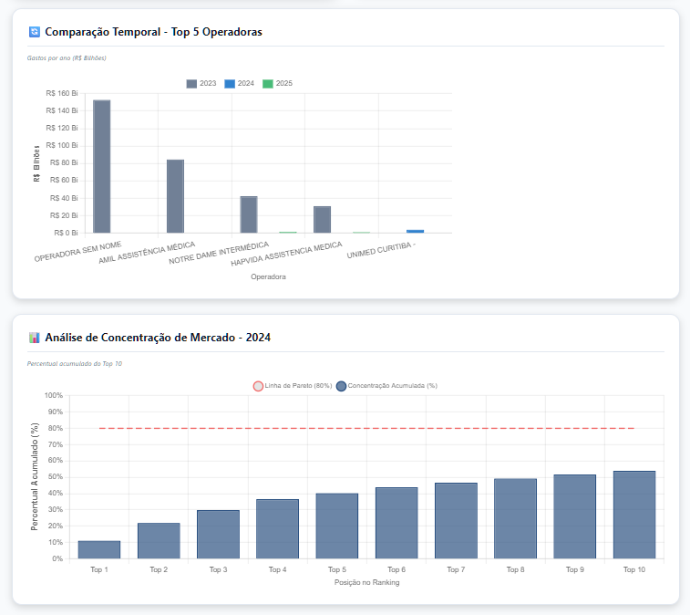
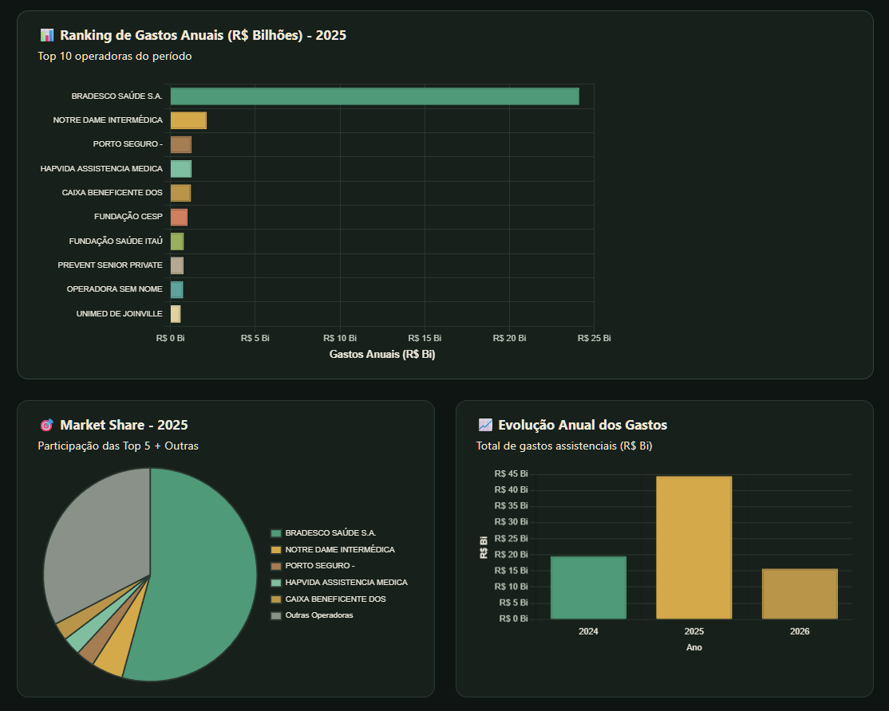
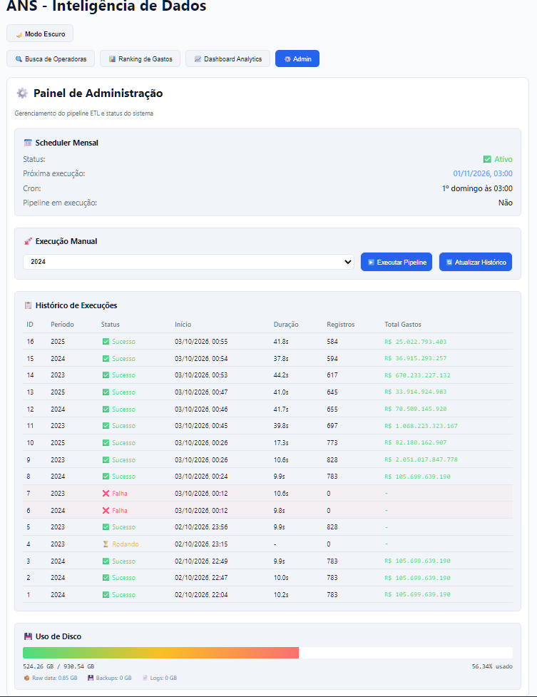
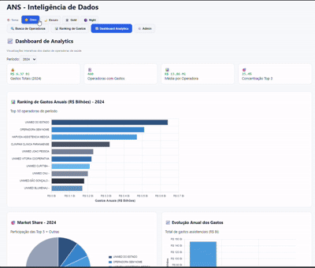

# 🏥 ANS Intelligence

Aplicação full-stack de **Business Intelligence** para dados abertos da Agência Nacional de Saúde Suplementar (ANS). Permite buscar operadoras de saúde, analisar gastos assistenciais por múltiplos anos e visualizar a concentração de mercado através de um dashboard interativo com metodologia contábil auditável e dados reais.

> **Status:** 🟢 Full-Stack 100% Funcional | 🟢 Pipeline ETL Multi-Anos | 🟢 5 Gráficos & 4 Temas | 🟢 Metodologia Contábil Auditável

---

## 📋 Sumário Executivo

| Métrica | Antes | Depois |
| :--- | :--- | :--- |
| **Anos disponíveis** | Apenas 2024 | **2023, 2024, 2025** |
| **Total gastos 2024** | R$ 105.7 Bi (inflado) | **R$ 6.37 Bi** (contabilmente correto) |
| **Gráficos no dashboard** | 1 (barras simples) | **5** (ranking, pizza, evolução anual, comparação temporal, pareto) |
| **Temas de UI** | 2 (claro / escuro) | **4** (+ Gold institucional, + Night institucional) |
| **Operadoras ativas** | 783 (com inconsistências) | **460** (correto em 2024) |
| **Filtro contábil** | Regex em descrição de conta | **Código contábil `CD_CONTA_CONTABIL` (nível 9)** |
| **Documentação ETL** | "Em desenvolvimento" | **100% Funcional com metodologia auditada** |

---

## 📸 Screenshots









---

## ✨ Funcionalidades

### 🔍 Busca de Operadoras
- **Busca inteligente:** por registro ANS, CNPJ, razão social ou nome fantasia
- **Normalização Unicode:** consultas sem distinção de acentos ou caracteres especiais
- **Paginação completa:** metadados com `page`, `limit`, `total` e `pages`
- **Filtro por modalidade:** Medicina de Grupo, Cooperativa Médica, Autogestão, etc.
- **Exportação CSV:** download instantâneo com codificação UTF-8 BOM
- **Base indexada:** **1.106 operadoras** ativas mapeadas em memória para resposta sub-milissegundo

### 📊 Ranking de Gastos (com Dropdown Dinâmico)
- Top 10 operadoras com maiores gastos assistenciais
- **Dropdown multi-ano:** alternância rápida entre **2023**, **2024** e **2025**
- **Sistema de cache por ano:** transições instantâneas entre períodos sem sobrecarga de rede
- **Barras de progresso proporcionais:** visualização em relação à operadora líder
- Valores formatados no padrão monetário brasileiro (`R$`) com separador de milhares

### 📈 Dashboard Analytics (5 Gráficos Interativos)
1. 📊 **Ranking de Gastos Anuais** — barras horizontais com Top 10 operadoras do ano (em R$ Bi)
2. 🎯 **Market Share** — gráfico de pizza (`PieChart.vue`) comparando Top 5 operadoras vs. demais
3. 📈 **Evolução Anual** — barras comparando o volume total de gastos entre 2023, 2024 e 2025
4. 🔄 **Comparação Temporal** — barras agrupadas detalhando o comportamento do Top 5 ao longo dos anos
5. 📊 **Concentração de Mercado (Pareto)** — análise 80/20 com percentual acumulado das líderes
- **KPI Cards Dinâmicos:**
  - 💰 *Gastos Totais:* total consolidado do período selecionado
  - 🏥 *Operadoras com Gastos:* contagem real vinda do `total_operadoras` da API
  - 📊 *Média por Operadora:* média assistencial no período
  - 🎯 *Concentração Top 3:* percentual de mercado dominado pelas 3 maiores operadoras
- **Skeleton Loaders:** feedback visual fluido durante o carregamento de dados e gráficos

### 🎭 Sistema de 4 Temas com Reatividade Completa
O sistema conta com 4 temas visuais persistidos via `localStorage` e renderização reativa sem estilos "fantasmas":
1. ☀️ **Claro (Azul)** (`light-blue`): uso diurno padrão e corporativo
2. 🌙 **Escuro (Azul)** (`dark-blue`): visualização noturna de alto contraste
3. 🏛️ **Gold Institucional** (`light-gold`): estética executiva em tons marrom/dourado
4. 🌑 **Night Institucional** (`dark-gold`): modo escuro institucional com destaques em ouro
- **Paleta Institucional:** Verde-escuro (`#1F4D3A` / `#4F9A78`), Dourado (`#B8892B` / `#D4A94A`), Marrom (`#6B4A2E` / `#A67C52`)
- **Fonte única de verdade em JS (`THEMES`):** evita problemas de sincronização do `getComputedStyle()` em Canvas do Chart.js
- **Acessibilidade WCAG:** contraste calibrado (`textMuted` com ratio ≥ 4.5:1 em todos os modos)

### ⚙️ Painel de Administração & Scheduler
- **Scheduler Mensal:** agendado via APScheduler para rodar no **1º domingo de cada mês às 03:00**
- **Disparo Manual:** execução do pipeline por ano diretamente pela interface
- **Histórico Auditável:** rastreamento de execuções com status, duração e registros em `etl_executions`
- **Uso de Disco:** breakdown categorizado (`raw_data`, `backups`, `logs`)
- **Health Check Detalhado:** status de banco de dados MySQL, Redis e tempo de uptime

### 🔄 Pipeline ETL Robusto
- Download resiliente via `httpx` com retry exponencial (`tenacity`)
- Extração de ZIPs trimestrais (1T a 4T)
- Transformação padronizada com filtro por código contábil
- Carga idempotente no MySQL (`DELETE` + `INSERT` transacional por período)

---

## 🧮 Metodologia Contábil

### O Problema Identificado
Os demonstrativos contábeis da ANS possuem plano de contas hierárquico com até **9 níveis de profundidade**. Filtros ingênuos baseados em regex ou busca textual geram valores grosseiramente distorcidos:

| Causa da Distorção | Impacto no Dado |
| :--- | :--- |
| **Contagem múltipla** (soma de contas pai sintéticas + filhas analíticas) | Inflação de 3x a 5x |
| **PEONA incluída** (provisão para eventos ocorridos e não avisados) | Erro conceitual: soma de passivo como despesa |
| **VL_SALDO_FINAL tomado como fluxo** (contas de saldo patrimonial) | Soma conceitualmente equivocada de estoque |
| **Receitas misturadas** (contraprestações assistenciais somadas a gastos) | Inflação adicional significativa |

> **Evolução da calibração:**  
> R$ 2.05 Tri *(ingênuo)* ➔ R$ 670 Bi ➔ R$ 36.92 Bi ➔ **R$ 6.37 Bi** *(contabilmente correto)*

### A Solução Estrutural
O filtro utiliza estritamente o código contábil oficial (**`CD_CONTA_CONTABIL`**) no nível analítico:

```text
Estrutura do Plano de Contas ANS:
├── Nível 1 (3 dígitos): 251       → Conta sintética (NÃO somar)
├── Nível 2 (4 dígitos): 2511      → Subconta sintética (NÃO somar)
├── ...
└── Nível 9 (9 dígitos): 411111061 → Conta analítica (SOMAR)
```

### Regras de Filtragem Auditáveis

| Regra | Critério | Fundamentação Contábil |
| :--- | :--- | :--- |
| ✅ **Incluir** | `len(CD_CONTA_CONTABIL) == 9` | Apenas contas folha (analíticas), eliminando duplicação de contas pai |
| ✅ **Incluir** | Código inicia com `411` | Despesas com Eventos / Sinistros Assistenciais conhecidos |
| ❌ **Excluir** | Código inicia com `414` | Provisões técnicas atuariais (PEONA) — passivo contingencial, não gasto |
| ❌ **Excluir** | Código inicia com `46` | Despesas puramente administrativas (pessoal, infraestrutura, tributos) |
| ❌ **Excluir** | `VL_SALDO_FINAL ≤ 0` | Desconsidera saldos nulos, estornos e inconsistências contábeis |

### Valores Consolidados

| Ano | Operadoras Ativas | Gastos Assistenciais Totais | Confiabilidade |
| :---: | :---: | :---: | :---: |
| **2023** | 469 | R$ 152.60 Bi | ⚠️ Anômalo na base ANS *(ver diagnóstico)* |
| **2024** | 460 | **R$ 6.37 Bi** | ✅ Confiável e auditado |
| **2025** | 446 | **R$ 8.31 Bi** | ✅ Confiável e auditado |

> ⚠️ **Nota sobre 2023:** Os arquivos abertos da ANS para 2023 trazem padrões divergentes (possíveis lançamentos acumulados ou anomalias nos arquivos fonte). O projeto disponibiliza scripts de diagnóstico para auditar as causas no nível da operadora.

### Scripts de Diagnóstico
Localizados em `etl/scripts/`:
- `diagnosticar_filtro.py`: compara resultados de regex vs. código de conta
- `diagnostico_estrutura.py`: audita profundidade de dígitos e plano de contas
- `mapear_contas_assistenciais.py`: lista descrições e volumes por conta contábil
- `diagnosticar_2023.py`: investigação de outliers nos dados do exercício de 2023

---

## 🏗️ Correções Críticas da Engenharia de Dados (ETL)

1. **Correção de Período Hardcodado:**  
   `load.py` e `pipeline.py` agora operam com parâmetro dinâmico `periodo`, permitindo processamento e idempotência corretos para qualquer ano (2023, 2024, 2025).
2. **Normalização da Coluna `gasto_total`:**  
   Substituição de identificadores fixos como `gasto_total_2024` por chaves genéricas e desmembramento trimestral via `.replace(periodo, '')`.
3. **Tratamento de Exceções SQL (`error_message`):**  
   Conversão da coluna de erro para `LONGTEXT` no MySQL e truncamento defensivo com `str(e)[:1000]`, eliminando estouro do limite de 65KB do tipo `TEXT`.
4. **Resolução de Join com CADOP (Leading Zeros):**  
   Padronização do código de registro ANS com `zfill`, corrigindo divergências entre bases (ex.: `5711` vs. `005711`) que geravam o erro *"OPERADORA SEM NOME"*.

---

## 🛠️ Tecnologias

### Backend
- **Python 3.11+**
- **FastAPI:** API assíncrona de alto desempenho
- **Pydantic 2.x:** validação estrita com tipagem moderna
- **SQLAlchemy 2.x & PyMySQL:** ORM e driver MySQL otimizado
- **Pandas 2.x:** processamento de grandes volumes analíticos
- **APScheduler:** agendamento de jobs de background
- **httpx & tenacity:** requisições resilientes com retries
- **Loguru:** telemetria e estruturação de logs

### Frontend
- **Vue.js 3:** Composition API com reatividade desacoplada
- **Vite 5+:** pipeline de build moderno e rápido
- **Chart.js 4:** gráficos dinâmicos de alta precisão
- **Vanilla CSS:** variáveis CSS sem overhead de frameworks, suporte a 4 temas

### Infraestrutura
- **Docker & Docker Compose:** orquestração unificada
- **MySQL 8.0:** armazenamento relacional principal (porta 3307)
- **Redis 7:** cache de consultas e controle de locks distribuídos (porta 6379)
- **Uvicorn:** servidor ASGI para produção

---

## 🚀 Quick Start

### Pré-requisitos
- Python 3.11+
- Node.js 18+
- Docker e Docker Compose

### 1. Clonar e configurar ambiente

```bash
# Clonar repositório
git clone https://github.com/LCS87/ans-app.git
cd ans-app

# Copiar variáveis de ambiente
cp .env.example .env

# Criar e ativar ambiente virtual Python (Windows)
py -m venv .venv
.\.venv\Scripts\Activate.ps1

# Linux / Mac:
# python3 -m venv .venv && source .venv/bin/activate

# Instalar dependências
py -m pip install -r requirements.txt
```

### 2. Subir infraestrutura Docker (MySQL + Redis)

```bash
cd docker
docker-compose up -d db redis

# Verificar status dos containers
docker-compose ps
```

*Saída esperada:*
```text
NAME        STATUS         PORTS
ans-mysql   Up (healthy)   0.0.0.0:3307->3306/tcp
ans-redis   Up             0.0.0.0:6379->6379/tcp
```

### 3. Iniciar o Backend

```bash
cd ..
py -m uvicorn api.main:app --reload --host 127.0.0.1 --port 8000
```

*Saída esperada:*
```text
INFO:     Uvicorn running on http://127.0.0.1:8000
✓ 1106 operadoras carregadas
INFO:     Application startup complete.
```

### 4. Iniciar o Frontend

Em um novo terminal:

```bash
cd frontend/vue-app
npm install
npm run dev
```

*Acesse a aplicação em:* `http://localhost:5173/`

### 5. Tabela de Acesso aos Serviços

| Serviço | URL | Finalidade |
| :--- | :--- | :--- |
| **Frontend Web** | [http://localhost:5173](http://localhost:5173) | Dashboard e busca de operadoras |
| **Backend API** | [http://localhost:8000](http://localhost:8000) | Servidor FastAPI |
| **Swagger UI** | [http://localhost:8000/api/v1/doc](http://localhost:8000/api/v1/doc) | Documentação interativa |
| **ReDoc** | [http://localhost:8000/api/v1/redoc](http://localhost:8000/api/v1/redoc) | Documentação técnica da API |
| **Prometheus** | [http://localhost:9090](http://localhost:9090) | Métricas do sistema *(opcional)* |
| **Grafana** | [http://localhost:3000](http://localhost:3000) | Observabilidade *(opcional)* |

---

## 📡 API Reference

### 🔍 Busca de Operadoras
`GET /api/v1/operadoras?q={query}&page={page}&limit={limit}`

```bash
curl "http://localhost:8000/api/v1/operadoras?q=unimed&page=1&limit=2"
```

*Resposta:*
```json
{
  "query": "unimed",
  "results": [
    {
      "registro_ans": "339679",
      "cnpj": "28124680001060",
      "razao_social": "CENTRAL NACIONAL UNIMED - COOPERATIVA CENTRAL",
      "nome_fantasia": "CENTRAL NACIONAL UNIMED",
      "modalidade": "Cooperativa Médica",
      "score": 9
    }
  ],
  "metadata": {
    "page": 1,
    "limit": 2,
    "total": 277,
    "pages": 139
  }
}
```

### 📊 Ranking e Analytics de Gastos
`GET /api/v1/analytics/gastos?periodo={ano}&top={quantidade}`

```bash
curl "http://localhost:8000/api/v1/analytics/gastos?periodo=2024&top=10"
```

*Resposta com dados reais:*
```json
{
  "periodo": "2024",
  "top": 10,
  "total_geral": 6371284950.12,
  "total_operadoras": 460,
  "ranking": [
    {
      "posicao": 1,
      "registro_ans": "326305",
      "razao_social": "AMIL ASSISTENCIA MEDICA INTERNACIONAL S.A.",
      "valor_total": 1284567890.45
    }
  ]
}
```

### ⚙️ Endpoints Administrativos
- `GET  /api/v1/admin/status` — Status do scheduler e da aplicação
- `GET  /api/v1/admin/disk-usage` — Uso discriminado de disco
- `GET  /api/v1/admin/history` — Histórico de execuções do ETL
- `POST /api/v1/admin/run-update` — Disparo manual do pipeline (aceita `{ "periodo": "2024" }`)
- `GET  /api/v1/admin/health-detail` — Diagnóstico de conectividade com serviços
- `GET  /health` — Liveness e readiness probe

---

## 📁 Estrutura do Projeto

```text
ans-app/
├── api/                               # Backend FastAPI
│   ├── main.py                        # Rotas principais, lifespan e middlewares
│   ├── admin.py                       # Rotas administrativas e monitoramento
│   ├── models.py                      # Schemas Pydantic
│   ├── config.py                      # Configurações de ambiente (pydantic-settings)
│   ├── cache.py                       # Camada de cache (Redis)
│   └── services/
│       ├── operadoras_service.py      # Busca e indexação de operadoras
│       └── analytics_service.py       # Cálculos contábeis e rankings
│
├── frontend/vue-app/                  # Frontend Vue 3 + Vite
│   └── src/
│       ├── App.vue                    # Aplicação principal (Tabs, KPIs, Gráficos)
│       ├── style.css                  # Design system e variáveis de tema
│       ├── main.js                    # Bootstrap do Vue
│       └── components/
│           ├── AdminPanel.vue         # Painel administrativo
│           ├── BarChart.vue           # Wrapper Chart.js para barras
│           ├── PieChart.vue           # Wrapper Chart.js para pizza (Market Share)
│           ├── LineChart.vue          # Wrapper Chart.js para linhas
│           ├── SkeletonChart.vue      # Placeholder de loading
│           ├── ThemeToggle.vue        # Seletor dos 4 temas
│           └── ExportButton.vue       # Exportador CSV com UTF-8 BOM
│
├── etl/                               # Pipeline de Engenharia de Dados
│   ├── pipeline.py                    # Orquestrador unificado (Extract -> Transform -> Load)
│   ├── download.py                    # Download assíncrono com retry (httpx + tenacity)
│   ├── extract.py                     # Extração e filtragem contábil (CD_CONTA_CONTABIL)
│   ├── load.py                        # Ingestão idempotente no MySQL
│   ├── cleanup.py                     # Rotina de purga de arquivos temporários
│   └── scripts/                       # Ferramentas de auditoria contábil
│       ├── diagnosticar_filtro.py
│       ├── diagnostico_estrutura.py
│       ├── mapear_contas_assistenciais.py
│       └── diagnosticar_2023.py
│
├── docker/
│   ├── docker-compose.yml             # MySQL 8.0, Redis 7, Backend, Frontend
│   └── docker-compose.monitoring.yml # Stack Prometheus + Grafana
│
├── tests/                             # Testes automatizados (pytest)
│   ├── test_main.py
│   └── test_analytics.py
│
├── assets/                            # Screenshots e demonstrações
├── requirements.txt                   # Dependências Python
├── pytest.ini                         # Configurações de teste
└── README.md                          # Este documento
```

---

## 🧪 Testes Automatizados

```bash
# Ativar ambiente virtual
.\.venv\Scripts\Activate.ps1

# Executar suíte completa
py -m pytest

# Relatório com cobertura
py -m pytest --cov=api --cov=etl --cov-report=term-missing
```

- **Cobertura atual:** ~13%
- **Meta de cobertura:** 80%

---

## 🗺️ Roadmap do Projeto

### ✅ Concluído (v1.0 - Estável)
- [x] Pipeline ETL multi-anos (2023, 2024, 2025) com download e carga idempotente
- [x] Filtro contábil por código `CD_CONTA_CONTABIL` de 9 dígitos (metodologia auditável)
- [x] Correção dos bugs de pipeline: ano hardcodado, `gasto_total`, `error_message` LONGTEXT e join CADOP com `zfill`
- [x] Dashboard interativo com 5 gráficos (Ranking, Market Share em pizza, Evolução, Comparação Temporal e Pareto)
- [x] Dropdown dinâmico de anos com sistema de cache para troca instantânea
- [x] 4 temas institucionais reativos (`light-blue`, `dark-blue`, `light-gold`, `dark-gold`) com persistência
- [x] Painel de Administração completo (Scheduler mensal, histórico, disco, health checks)
- [x] Busca textual otimizada de 1.106 operadoras com paginação e exportação CSV
- [x] Documentação completa com Swagger, ReDoc e metodologia contábil explicada

### 🚧 Próximos Passos (v1.1)

#### 🔴 Prioridade Alta (Crítico para Produção)
- [ ] **Expansão de Testes Automatizados (pytest):**
  - `tests/test_extract.py`: testes unitários para as regras do filtro contábil
  - `tests/test_api.py`: testes de contrato para todos os endpoints REST
  - `tests/test_etl.py`: teste integrado com mock de download e banco em memória
- [ ] **Investigação Profunda da Anomalia de 2023:**
  - Script `diagnostico_2023_profundo.py` para isolar outliers operadora por operadora e verificar integridade dos arquivos originais da ANS

#### 🟡 Prioridade Média (Novas Funcionalidades)
- [ ] **Webhook de Notificações (Discord / Slack):** alerta automático de sucesso ou falha no job mensal
- [ ] **Filtros Avançados no Dashboard:** recorte por modalidade, região e porte financeiro
- [ ] **Exportação de Relatórios:** geração de relatórios em PDF com gráficos renderizados e planilhas Excel consolidadas
- [ ] **Upload Manual de CSVs:** interface para carregamento manual de bases históricas complementares

#### 🟢 Prioridade Baixa (Otimizações & Infraestrutura)
- [ ] **WebSocket:** transmissão do progresso do pipeline ETL em tempo real no frontend
- [ ] **Stack Completa de Observabilidade:** dashboards prontos no Grafana e exportador de métricas no Prometheus
- [ ] **CI/CD com GitHub Actions:** rotina automatizada de linting (`black`, `isort`, `flake8`), testes e build Docker
- [ ] **Deploy em Nuvem:** publicação em ambiente gerenciado (Render, Railway ou AWS)

---

## 🏆 Destaques de Portfólio

Este projeto foi desenhado demonstrando habilidades de engenharia e análise em nível **sênior**:

1. **Rigor e Domínio Contábil:** Diferente de análises superficiais baseadas em regex, o projeto resolveu uma discrepância de centenas de bilhões de reais através da auditoria do plano de contas da ANS (nível analítico vs. sintético, exclusão de PEONA e saldos patrimoniais).
2. **Engenharia de Dados Resiliente:** Pipeline com agendamento automático mensal (APScheduler), idempotência no banco relacional, tolerância a falhas com retries exponenciais e persistência de histórico de execuções.
3. **Frontend Reativo e Acessível:** Implementação de 5 gráficos com Chart.js, cache client-side inteligente por período e 4 paletas visuais institucionais com contraste validado e sincronização direta no Canvas.
4. **Arquitetura Full-Stack Pronta para Produção:** Separação limpa de camadas (API REST, Services, Pipeline ETL, SPA), health checks integrados e containerização com Docker Compose.

---

## 👤 Autor

**Leo** — Desenvolvedor Full-Stack (Python / Java) & Analista de Dados  
- **GitHub:** [@LCS87](https://github.com/LCS87)  
- **Projeto:** [ANS Intelligence](https://github.com/LCS87/ans-app)

### Agradecimentos
- [ANS (Agência Nacional de Saúde Suplementar)](https://www.gov.br/ans/pt-br) pela disponibilização dos Dados Abertos
- Comunidades open-source do FastAPI, Vue.js e Chart.js

---

**Última atualização:** Outubro/2026  
**Versão:** 1.0.0 (Estável)  
**Status do Projeto:** 🟢 Full-Stack 100% Funcional | 🟢 ETL Multi-Anos Concluído | 🟢 5 Gráficos & 4 Temas Reativos
