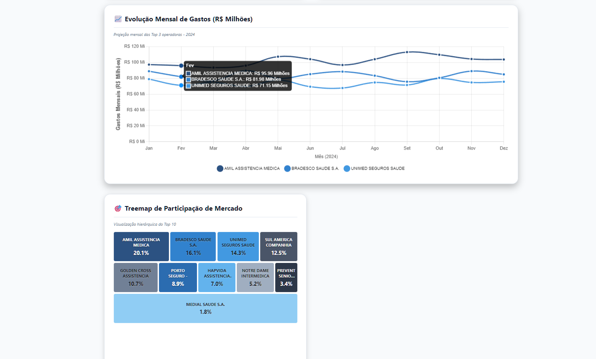
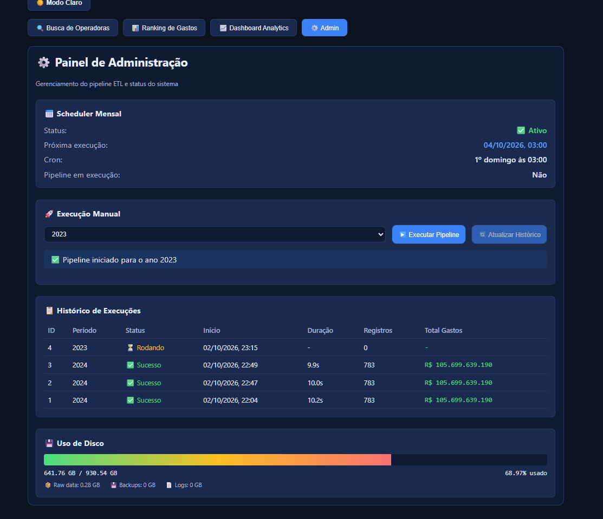
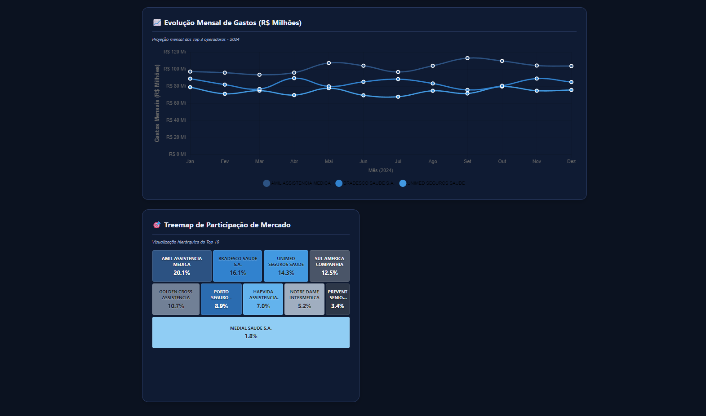
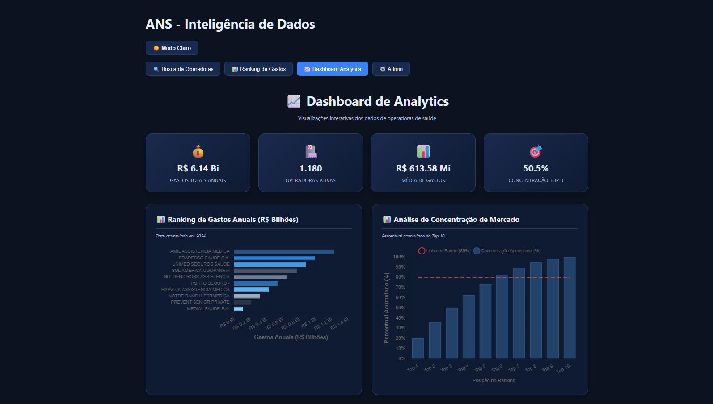
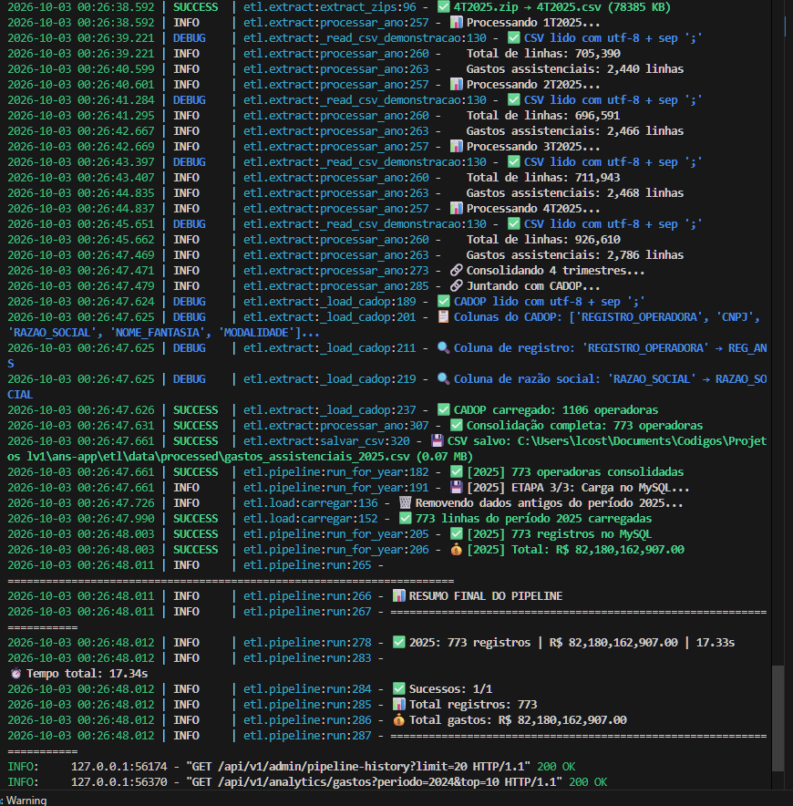

# ANS Intelligence

Aplicação full-stack de Business Intelligence para dados da Agência Nacional de Saúde Suplementar (ANS). Permite buscar operadoras de saúde, analisar gastos assistenciais e visualizar a concentração de mercado através de um dashboard interativo.

> **Status:**  Backend 100% funcional | 🟡 Frontend 80% funcional | 🔴 ETL em desenvolvimento

---

## 📸 Screenshots











---

## ✨ Funcionalidades

### 🔍 Busca de Operadoras
- Busca por registro ANS, CNPJ, razão social ou nome fantasia
- Normalização Unicode para buscas sem acento
- Paginação completa com metadata (page, limit, total, pages)
- Filtro por modalidade (Medicina de Grupo, Cooperativa, etc.)
- Exportação para CSV com encoding UTF-8 BOM
- Validação tolerante (registros inválidos são pulados silenciosamente)

### 📊 Ranking de Gastos
- Top 10 operadoras com maiores gastos assistenciais
- Barras de progresso relativas ao líder
- Valores formatados em R$ com separador de milhares
- *Dados atualmente em modo demonstração (ETL em desenvolvimento)*

### 📈 Dashboard Analytics
- Ranking de gastos anuais em R$ Bilhões (barras horizontais)
- Análise de concentração de mercado com linha de Pareto (80%)
- Evolução mensal das Top 3 operadoras em R$ Milhões
- Treemap de participação de mercado com paleta de cores consistente
- KPI cards: gastos totais, operadoras ativas, média e concentração Top 3
- Skeleton loaders para estados de carregamento

### 🎨 Interface
- Toggle Dark/Light com persistência via localStorage
- CSS Variables para temas consistentes
- Design responsivo (mobile-first)
- Animações suaves (fadeIn, hover effects)

### ⚙️ Administração
- Painel Admin com status do sistema em tempo real
- Execução manual de atualização via UI
- Monitoramento de uso de disco com breakdown por categoria
- Histórico de execuções com status e duração
- Health check detalhado (MySQL, Redis, uptime)

### 🔄 Pipeline ETL
- Limpeza automática de arquivos antigos (políticas de retenção)
- Notificações de falha via Discord webhook
- Scheduler mensal configurado (1º domingo, 03:00)
- Lock Redis para prevenir execução concorrente
- *Pipeline completo em desenvolvimento (download/extract/transform/load)*

### 📊 Observabilidade
- Prometheus + Grafana via Docker Compose
- Health checks endpoints
- Logs estruturados com rotação automática

---

## 🛠️ Tecnologias

### Backend

| Tecnologia | Versão | Uso |
|---|---|---|
| Python | 3.11+ | Linguagem principal |
| FastAPI | 0.100+ | Framework REST API |
| Pydantic | 2.x | Validação e serialização de dados |
| Pandas | 2.x | Processamento de dados CSV |
| PyMySQL | 1.1+ | Driver MySQL |
| Redis | 7 | Cache em memória |
| MySQL | 8.0 | Banco de dados relacional |
| APScheduler | 3.10+ | Agendamento de tarefas |

### Frontend

| Tecnologia | Versão | Uso |
|---|---|---|
| Vue.js | 3 | Framework reativo (Composition API) |
| Vite | 5+ | Build tool e dev server |
| Chart.js | 4 | Gráficos interativos |
| vue-chartjs | 5 | Wrapper Vue para Chart.js |

### ETL

| Tecnologia | Uso |
|---|---|
| BeautifulSoup4 | Web scraping do portal ANS |
| Tabula-py | Extração de tabelas de PDFs |
| Requests/httpx | Download de arquivos |
| Loguru | Logging estruturado |

### Infraestrutura

| Tecnologia | Uso |
|---|---|
| Docker Compose | Orquestração de containers |
| Uvicorn | ASGI server para FastAPI |
| Prometheus | Coleta de métricas |
| Grafana | Dashboards de monitoramento |

---

## 🚀 Quick Start

### Pré-requisitos

- Python 3.11+
- Node.js 18+
- Docker e Docker Compose
- PowerShell (Windows) ou Bash (Linux/Mac)

### 1. Clonar e configurar ambiente

```bash
# Clonar repositório
git clone <repo-url>
cd ans-app

# Copiar variáveis de ambiente
cp .env.example .env

# Criar ambiente virtual Python
py -m venv .venv

# Windows (PowerShell)
.\.venv\Scripts\Activate.ps1

# Linux/Mac
source .venv/bin/activate

# Instalar dependências
py -m pip install -r requirements.txt