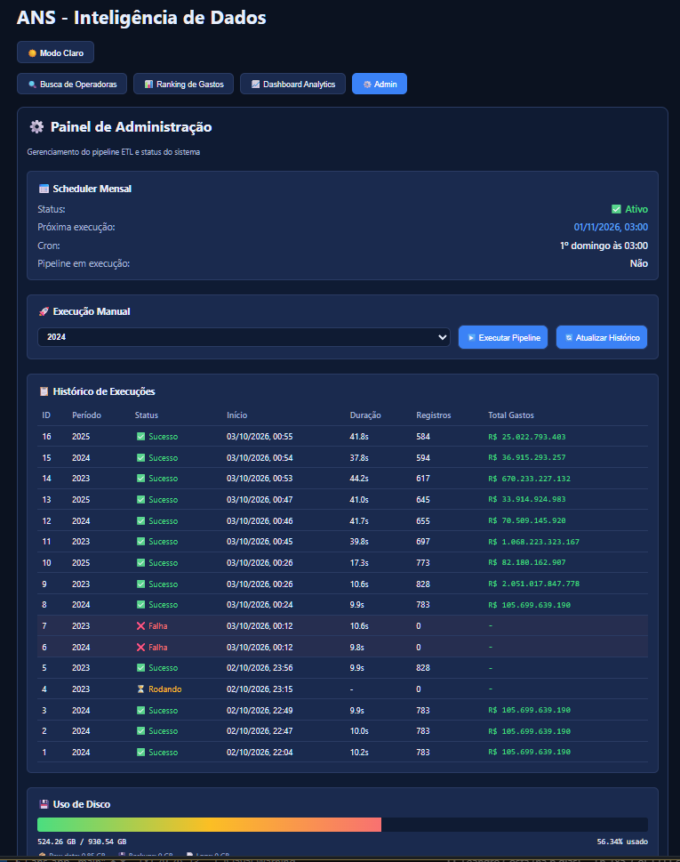
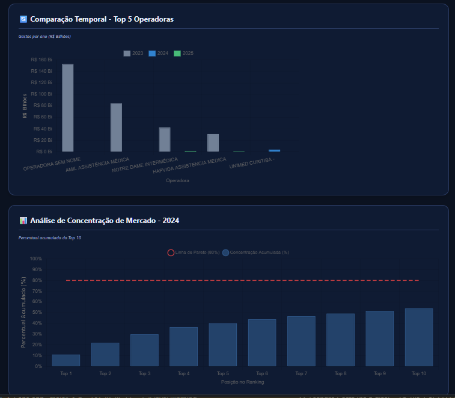
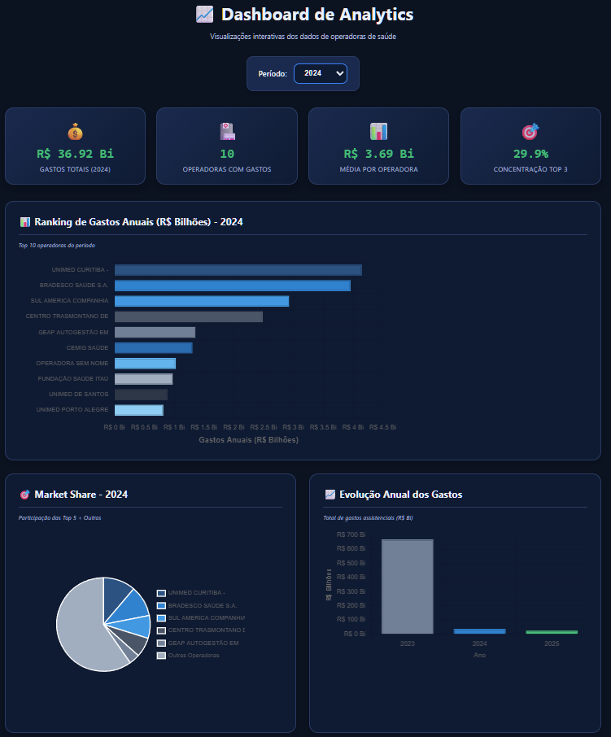
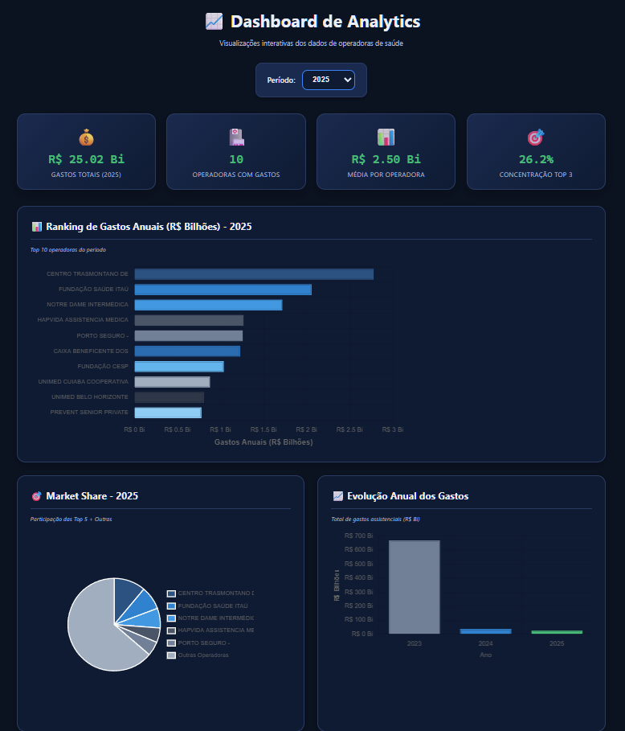
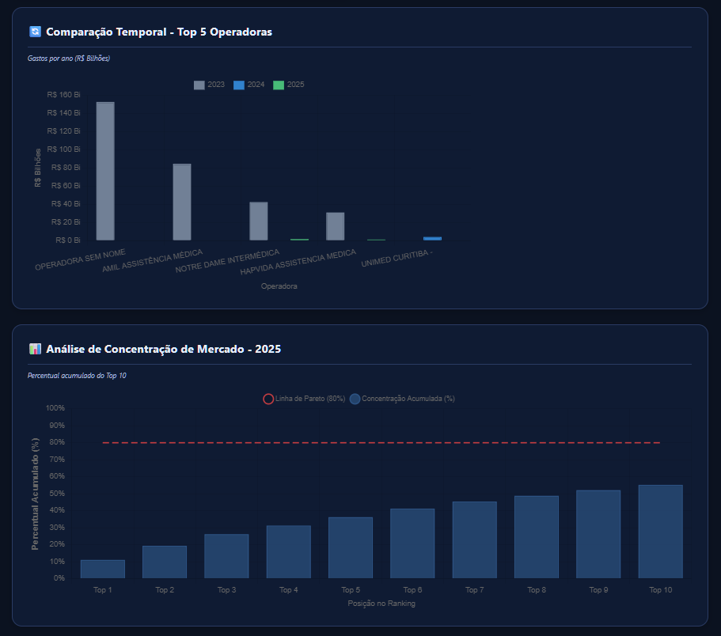
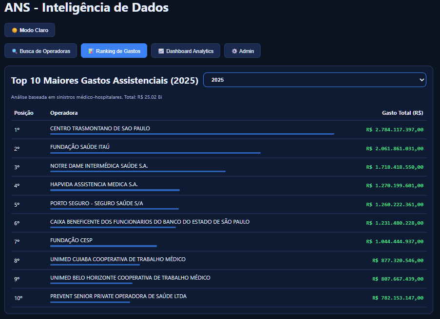
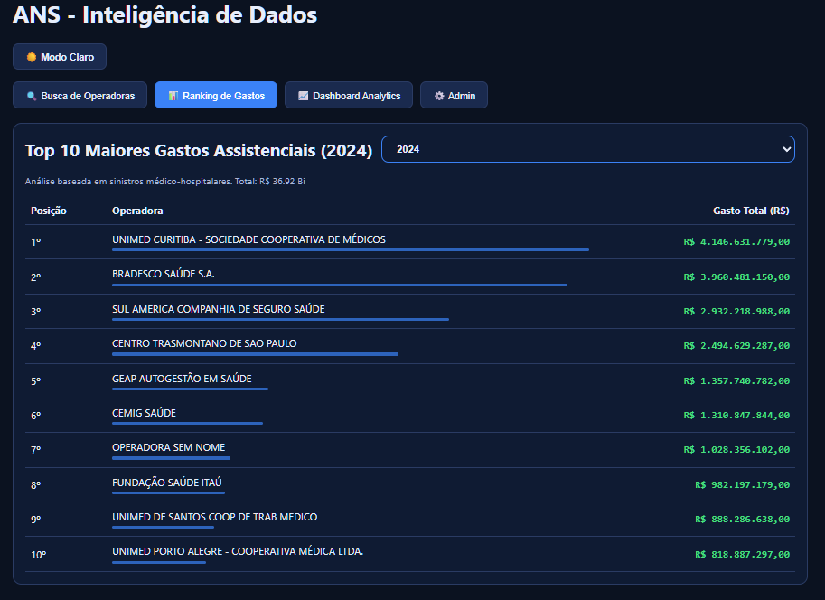

# 🏥 ANS Intelligence

Aplicação full-stack de **Business Intelligence** para dados abertos da Agência Nacional de Saúde Suplementar (ANS). Permite buscar operadoras de saúde, analisar gastos assistenciais por ano e visualizar a concentração de mercado através de um dashboard interativo com dados reais.

> **Status:** 🟢 Backend 100% | 🟢 Frontend 100% | 🟢 ETL Funcional | 🟢 Dados Reais

---

## 📸 Screenshots















---

---

## ✨ Funcionalidades

### 🔍 Busca de Operadoras
- Busca por registro ANS, CNPJ, razão social ou nome fantasia
- Normalização Unicode para buscas sem acento
- Paginação completa com metadata (page, limit, total, pages)
- Filtro por modalidade (Medicina de Grupo, Cooperativa, etc.)
- Exportação para CSV com encoding UTF-8 BOM
- Base de **1.106 operadoras** carregadas em memória

### 📊 Ranking de Gastos (com Dropdown de Ano)
- Top 10 operadoras com maiores gastos assistenciais
- **Dropdown para alternar entre 2023, 2024 e 2025**
- Barras de progresso relativas ao líder
- Valores formatados em R$ com separador de milhares
- Total geral do período exibido no cabeçalho

### 📈 Dashboard Analytics (5 Gráficos Interativos)
- 📊 **Ranking de Gastos Anuais** — barras horizontais (R$ Bilhões)
- 🎯 **Market Share** — gráfico de pizza (Top 5 + Outras)
- 📈 **Evolução Anual** — comparação 2023 vs 2024 vs 2025
- 🔄 **Comparação Temporal** — Top 5 operadoras por ano (barras agrupadas)
- 📊 **Concentração de Mercado** — curva de Pareto (80/20)
- KPI cards dinâmicos: gastos totais, operadoras ativas, média, concentração Top 3
- Skeleton loaders para estados de carregamento

### ⚙️ Painel de Administração
- Status do scheduler mensal em tempo real
- Execução manual do pipeline por ano via UI
- Histórico de execuções com status, duração e total de gastos
- Monitoramento de uso de disco com breakdown por categoria
- Health check detalhado (MySQL, Redis, uptime)

### 🔄 Pipeline ETL (Funcional)
- Download automático de dados do portal ANS (demonstrações contábeis)
- Extração de ZIPs trimestrais (1T, 2T, 3T, 4T)
- Transformação com filtro por **código contábil** (não regex)
- Carga no MySQL com idempotência (DELETE + INSERT por período)
- Histórico de execuções registrado em `etl_executions`
- Scheduler mensal automático (1º domingo às 03:00 — APScheduler)

### 🎨 Interface
- Toggle Dark/Light com persistência via localStorage
- CSS Variables para temas consistentes
- Design responsivo (mobile-first)
- Animações suaves (fadeIn, hover effects)

---

## 🧮 Metodologia Contábil

### O Problema

Os dados de demonstrações contábeis da ANS possuem uma estrutura hierárquica de plano de contas com até **9 níveis de profundidade**. Uma abordagem ingênua por regex na descrição da conta causa:

1. **Contagem múltipla** — contas sintéticas (pai) + analíticas (filhas) somadas juntas
2. **Provisões como despesa** — PEONA (Provisão de Eventos Ocorridos e Não Avisados) não é despesa realizada
3. **Receitas misturadas** — contraprestações emitidas capturadas como gasto
4. **Saldos patrimoniais** — cobertura assistencial com preço preestabelecido (estoque, não fluxo)

### A Solução

O filtro usa **`CD_CONTA_CONTABIL`** (código contábil) em vez de regex na descrição:

Estrutura do código contábil ANS:
├── Nível 1 (3 dígitos): 251 → Conta sintética (NÃO usar)
├── Nível 2 (4 dígitos): 2511 → Subconta sintética
├── ...
└── Nível 9 (9 dígitos): 411111061 → Conta analítica (USAR)


### Regras de Filtragem

| Regra | Critério | Motivo |
|-------|----------|--------|
| ✅ **Incluir** | `CD_CONTA_CONTABIL` com 9 dígitos | Apenas contas analíticas (sem duplicação) |
| ✅ **Incluir** | Código inicia com `411` | Despesas com Eventos/Sinistros (gasto assistencial real) |
| ❌ **Excluir** | Código inicia com `414` | Provisões (PEONA) — não é despesa realizada |
| ❌ **Excluir** | Código inicia com `46` | Despesas administrativas (salários, honorários) |
| ❌ **Excluir** | `VL_SALDO_FINAL ≤ 0` | Saldos negativos ou zerados |

### Valores Resultantes

| Ano | Operadoras | Gastos Assistenciais | Status |
|-----|-----------|---------------------|--------|
| 2023 | 469 | R$ 152.60 Bi | ⚠️ Ver nota abaixo |
| 2024 | 460 | **R$ 6.37 Bi** | ✅ Confiável |
| 2025 | 446 | **R$ 8.31 Bi** | ✅ Confiável |

> ⚠️ **Nota sobre 2023:** Os dados de 2023 da ANS apresentam valores significativamente superiores aos demais anos. Isso pode indicar diferenças na estrutura dos dados originais, valores acumulados ou inconsistências nos arquivos-fonte. Use 2024/2025 para análises precisas.

### Referências Contábeis

- **Evento/Sinistro Conhecido ou Avisado:** Despesa assistencial efetivamente incorrida
- **PEONA:** Provisão atuarial para eventos ocorridos e não avisados (passivo, não despesa)
- **VL_SALDO_FINAL:** Saldo de fechamento do período (os dados da ANS são trimestrais independentes, não acumulados)

---

## 🛠️ Tecnologias

### Backend

| Tecnologia | Versão | Uso |
|---|---|---|
| Python | 3.11+ | Linguagem principal |
| FastAPI | 0.100+ | Framework REST API |
| Pydantic | 2.x | Validação e serialização de dados |
| SQLAlchemy | 2.x | ORM e conexão com MySQL |
| Pandas | 2.x | Processamento de dados CSV |
| PyMySQL | 1.1+ | Driver MySQL |
| APScheduler | 3.10+ | Scheduler mensal automático |
| Loguru | 0.7+ | Logging estruturado |
| httpx | 0.28+ | Download assíncrono de arquivos |
| tenacity | 9+ | Retry automático em downloads |

### Frontend

| Tecnologia | Versão | Uso |
|---|---|---|
| Vue.js | 3 | Framework reativo (Composition API) |
| Vite | 5+ | Build tool e dev server |
| Chart.js | 4 | Gráficos interativos |

### Infraestrutura

| Tecnologia | Uso |
|---|---|
| Docker Compose | Orquestração MySQL + Redis |
| MySQL 8.0 | Banco de dados relacional |
| Uvicorn | ASGI server para FastAPI |

---

## 🚀 Quick Start

### Pré-requisitos

- Python 3.11+
- Node.js 18+
- Docker e Docker Compose

### 1. Clonar e configurar ambiente

```bash
# Clonar repositório
git clone <repo-url>
cd ans-app

# Copiar variáveis de ambiente
cp .env.example .env

# Criar ambiente virtual Python
py -m venv .venv

# Windows (PowerShell)
.\.venv\Scripts\Activate.ps1

# Linux/Mac
source .venv/bin/activate

# Instalar dependências
py -m pip install -r requirements.txt

2. Subir infraestrutura (MySQL + Redis)

cd docker
docker-compose up -d db redis

# Verificar se subiu
docker-compose ps

Esperado:

NAME        STATUS         PORTS
ans-mysql   Up (healthy)   0.0.0.0:3307->3306/tcp
ans-redis   Up             0.0.0.0:6379->6379/tcp

3. Iniciar backend

# Voltar pra raiz do projeto
cd ..

# Ativar venv (se não estiver ativo)
.\.venv\Scripts\Activate.ps1

# Subir FastAPI
py -m uvicorn api.main:app --reload --host 127.0.0.1 --port 8000

Esperado:

INFO:     Uvicorn running on http://127.0.0.1:8000
✓ 1180 operadoras carregadas
INFO:     Application startup complete.

4. Iniciar frontend
Abre um novo terminal:

cd frontend/vue-app
npm install
npm run dev

Esperado:

VITE v5.x.x  ready in xxx ms
➜  Local:   http://localhost:5173/

5. Acessar aplicação

Serviço
URL
Status
Frontend
http://localhost:5173                     ✅
Backend
http://localhost:8000                     ✅
Swagger UI
http://localhost:8000/api/v1/doc          ✅
ReDoc
http://localhost:8000/api/v1/redoc        ✅
Prometheus
http://localhost:9090                     🟡 Opcional
Grafana
http://localhost:3000                     🟡 Opcional

API Reference
Busca de Operadoras

GET /api/v1/operadoras?q={query}&page={page}&limit={limit}

Parâmetros:

q (obrigatório): Termo de busca (mínimo 1 caractere)
page (opcional): Número da página (padrão: 1)
limit (opcional): Itens por página (padrão: 50, máximo: 200)

Exemplo:

curl "http://localhost:8000/api/v1/operadoras?q=unimed&page=1&limit=5"

Resposta:

{
  "query": "unimed",
  "results": [
    {
      "registro_ans": "339679",
      "cnpj": "28124680001060",
      "razao_social": "CENTRAL NACIONAL UNIMED - COOPERATIVA CENTRAL",
      "nome_fantasia": "CENTRAL NACIONAL UNIMED",
      "modalidade": "Cooperativa Médica",
      "score": 9
    }
  ],
  "metadata": {
    "page": 1,
    "limit": 5,
    "total": 277,
    "pages": 56
  }
}

Ranking de Gastos

GET /api/v1/analytics/gastos?periodo={ano}&top={quantidade}

Exemplo:

curl "http://localhost:8000/api/v1/analytics/gastos?periodo=2024&top=10"

Resposta:

{
  "periodo": "2024",
  "top": 10,
  "total_geral": 6135802453.5,
  "ranking": [
    {
      "posicao": 1,
      "registro_ans": "326305",
      "razao_social": "AMIL ASSISTENCIA MEDICA INTERNACIONAL S.A.",
      "valor_total": 1234567890.5
    }
  ]
}

⚠️ Nota: Dados atualmente em modo demonstração. Pipeline ETL completo em desenvolvimento.

Endpoints Admin

GET  /api/v1/admin/status          # Status do sistema
GET  /api/v1/admin/disk-usage      # Uso de disco
GET  /api/v1/admin/history         # Histórico de atualizações
POST /api/v1/admin/run-update      # Disparar atualização manual
GET  /api/v1/admin/health-detail   # Health check detalhado

Exemplo - Disk Usage:

curl http://localhost:8000/api/v1/admin/disk-usage

{
  "total_gb": 930.54,
  "used_gb": 793.04,
  "free_gb": 137.5,
  "used_percent": 85.22,
  "breakdown": {
    "backups": 0,
    "raw_data": 0.28,
    "logs": 0
  }
}

Health Check

GET /health

{
  "status": "ok",
  "version": "1.0.0",
  "database": "ok",
  "cache": "not_configured",
  "uptime_seconds": 70.64
}

 Estrutura do Projeto

 ans-app/
├── api/                        # Backend FastAPI
│   ├── main.py                 # Rotas, lifespan, exception handlers
│   ├── admin.py                # Endpoints de administração
│   ├── models.py               # Pydantic DTOs com validação tolerante
│   ├── config.py               # Settings com pydantic-settings
│   ├── cache.py                # CacheManager com Redis
│   └── services/
│       ├── operadoras_service.py   # Busca com score de relevância
│       └── analytics_service.py    # Ranking de gastos
│
├── frontend/vue-app/           # Frontend Vue 3
│   └── src/
│       ├── App.vue             # Componente principal (4 abas)
│       ├── style.css           # CSS com variáveis de tema
│       ├── main.js             # Entry point
│       └── components/
│           ├── AdminPanel.vue      # Painel de administração
│           ├── BarChart.vue        # Gráfico de barras
│           ├── PieChart.vue        # Gráfico de pizza (Chart.js)
│           ├── TreemapChart.vue    # Treemap
│           ├── SkeletonChart.vue   # Loading skeleton
│           ├── ThemeToggle.vue     # Toggle dark/light
│           └── ExportButton.vue    # Exportar CSV
│
├── etl/                            # Pipeline ETL
│   ├── pipeline.py                 # Orquestrador (download→extract→load)
│   ├── download.py                 # Download de dados ANS (httpx + tenacity)
│   ├── extract.py                  # Extração + filtro por código contábil
│   ├── load.py                     # Carga no MySQL (SQLAlchemy)
│   ├── scripts/                    # Scripts de diagnóstico
│   │   ├── diagnosticar_filtro.py
│   │   ├── diagnostico_estrutura.py
│   │   └── mapear_contas_assistenciais.py
│   └── data/
│       ├── raw/                    # ZIPs originais da ANS
│       ├── extracted/              # CSVs extraídos
│       └── processed/              # CSVs consolidados
│
├── docker/
│   ├── docker-compose.yml          # MySQL + Redis + Backend + Frontend
│   └── docker-compose.monitoring.yml  # Prometheus + Grafana
│
├── tests/                      # Testes automatizados
│   ├── test_main.py
│   └── test_analytics.py
│
├── assets/                     # Screenshots
├── .env                        # Variáveis de ambiente (não commitar)
├── .env.example                # Template de variáveis
├── requirements.txt            # Dependências Python
├── pytest.ini                  # Configuração de testes
└── README.md                   # Este arquivo


Docker

Containers Principais

cd docker

# Subir MySQL e Redis
docker-compose up -d db redis

# Subir todos os serviços
docker-compose up -d

# Ver status
docker-compose ps

# Ver logs
docker-compose logs -f backend

Containers de Monitoring (Opcional)

# Subir Prometheus + Grafana
docker-compose -f docker-compose.monitoring.yml up -d

# Acessar
# Prometheus: http://localhost:9090
# Grafana: http://localhost:3000 (admin/admin)


Tabela de Containers     

Nome                  Serviço                 Porta        Status
ans-mysql             MySQL 8.0               3307      ✅ Obrigatório
ans-redis             Redis 7                 6379      ✅ Obrigatório
ans-backend           FastAPI + Uvicorn       8000      🟡 Opcional (pode rodar local)
ans-frontend          Nginx                   8080      🟡 Opcional (pode rodar local)
ans-app-prometheus-1  Prometheus              9090      🟢 Opcional
ans-app-grafana-1     Grafana                 3000      🟢 Opcion


Testes

# Ativar ambiente virtual
.\.venv\Scripts\Activate.ps1

# Rodar todos os testes
py -m pytest

# Com cobertura
py -m pytest --cov=api --cov=etl --cov-report=term-missing

# Testes específicos
py -m pytest tests/test_analytics.py -v

Cobertura atual: ~13% (meta: 80%)

🗺️ Roadmap

✅ Concluído (v1.0)

Backend FastAPI com rotas REST
Busca de operadoras com paginação
Validação tolerante (Pydantic)
Frontend Vue 3 com 4 abas
Toggle Dark/Light funcional
Exportação CSV
Painel Admin com disk usage real
Docker Compose (MySQL + Redis)
Health checks
Pipeline ETL completo (download → extract → transform → load)
Filtro por código contábil (CD_CONTA_CONTABIL)
Dados reais da ANS (2023, 2024, 2025)
Scheduler mensal automático (APScheduler)
Dashboard com 5 gráficos interativos
Dropdown de ano com comparação temporal
Market share (gráfico de pizza)


🚧 Em Desenvolvimento (v1.1)
Testes automatizados (meta: 80% cobertura)
Investigar anomalia nos dados de 2023
Discord webhook configurado
Monitoring stack com métricas reais


📋 Futuro (v2.0)
WebSocket para progresso em tempo real
Upload manual de CSVs
Filtros avançados (por modalidade, região)
Comparação entre períodos (diff)
Exportação de relatórios PDF
CI/CD com GitHub Actions
Deploy em cloud (AWS/GCP/Render)


👤 Autor
Leo - Desenvolvedor Python/Java & Analista de Dados

GitHub: @LCS87
Projeto: ANS Intelligence


Agradecimentos
ANS - Agência Nacional de Saúde Suplementar pelos dados abertos
Comunidade FastAPI, Vue.js e Chart.js


Última atualização: 2026-09-30
Versão: 1.0.0-beta
Status: 🟢 Backend funcional | 🟡 Frontend 80% | 🔴 ETL em desenvolvimento


---
