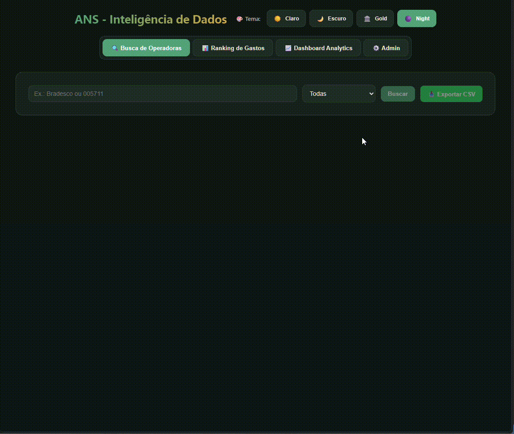

# 🏥 ANS Intelligence

Aplicação full-stack de **Business Intelligence** para dados abertos da Agência Nacional de Saúde Suplementar (ANS). Permite buscar operadoras de saúde, analisar gastos assistenciais por múltiplos anos e visualizar a concentração de mercado através de um dashboard interativo com metodologia contábil auditável e dados reais.

> **Status:** 🟢 Full-Stack 100% Funcional | 🟢 Pipeline ETL Multi-Anos com Gate de Qualidade | 🟢 5 Gráficos & 4 Temas | 🟢 Metodologia D Auditada

---

## 📋 Sumário Executivo

| Métrica | Antes (v1.0) | Depois (v1.1) |
| :--- | :--- | :--- |
| **Escopo acadêmico** | 2023, 2024, 2025 | **2024 + 2025** (validados) + **2026** (parcial, acompanhamento) |
| **Total gastos 2024** | R$ 6.37 Bi | **R$ 19.57 Bi** *(com lacuna ANS documentada)* |
| **Total gastos 2025** | R$ 8.31 Bi | **R$ 44.48 Bi** *(ano de referência completo)* |
| **Total gastos 2026** | — | **R$ 15.69 Bi** *(2 de 4 trimestres)* |
| **Operadoras ativas 2025** | 446 | **581** |
| **Metodologia contábil** | `len(CD_CONTA_CONTABIL) == 9` | **Método D (híbrido)** — folha com fallback inteligente |
| **Gate de qualidade** | Inexistente | ✅ Validação automática antes da carga |
| **Gráficos no dashboard** | 5 | **5 + Timeline de anos com badges** |
| **Temas de UI** | 4 | **4** (fundos claros recalibrados) |

---

## 📸 Screenshots




---

## ✨ Funcionalidades

### 🔍 Busca de Operadoras
- **Busca inteligente:** por registro ANS, CNPJ, razão social ou nome fantasia
- **Normalização Unicode:** consultas sem distinção de acentos ou caracteres especiais
- **Paginação completa:** metadados com `page`, `limit`, `total` e `pages`
- **Filtro por modalidade:** Medicina de Grupo, Cooperativa Médica, Autogestão, etc.
- **Exportação CSV:** download instantâneo com codificação UTF-8 BOM
- **Base indexada:** **1.106 operadoras** ativas mapeadas em memória para resposta sub-milissegundo

### 📊 Ranking de Gastos (com Badges de Qualidade)
- Top 10 operadoras com maiores gastos assistenciais
- **Dropdown multi-ano** com indicadores visuais: ✅ Completo, ⚠️ Parcial, ⚠️ Lacuna ANS
- **Badge de metadata:** `<YearBadge>` ao lado do título indicando status do período selecionado
- **Disclaimer acadêmico:** `<AcademicDisclaimer>` contextual quando há ressalvas metodológicas
- **Sistema de cache por ano:** transições instantâneas entre períodos sem sobrecarga de rede
- **Barras de progresso proporcionais:** visualização em relação à operadora líder
- Valores formatados no padrão monetário brasileiro (`R$`) com separador de milhares

### 📈 Dashboard Analytics (Timeline + 5 Gráficos Interativos)
- **🗓️ Timeline de Anos (`YearTimeline`):** barras comparativas clicáveis mostrando 2024/2025/2026 lado a lado, com alturas proporcionais ao total e badges de qualidade
- **1. 📊 Ranking de Gastos Anuais** — barras horizontais com Top 10 operadoras do ano (em R$ Bi)
- **2. 🎯 Market Share** — gráfico de pizza (`PieChart.vue`) comparando Top 5 operadoras vs. demais
- **3. 📈 Evolução Anual** — barras comparando o volume total de gastos entre os anos do escopo
- **4. 🔄 Comparação Temporal** — barras agrupadas detalhando o comportamento do Top 5 ao longo dos anos
- **5. 📊 Concentração de Mercado (Pareto)** — análise 80/20 com percentual acumulado das líderes

**KPI Cards Dinâmicos:**
- 💰 *Gastos Totais:* total consolidado do período selecionado
- 🏥 *Operadoras com Gastos:* contagem real vinda do `total_operadoras` da API
- 📊 *Média por Operadora:* média assistencial no período
- 🎯 *Concentração Top 3:* percentual de mercado dominado pelas 3 maiores operadoras

**Skeleton Loaders:** feedback visual fluido durante o carregamento de dados e gráficos

### 🎭 Sistema de 4 Temas com Reatividade Completa
O sistema conta com 4 temas visuais persistidos via `localStorage` e renderização reativa sem estilos "fantasmas":
1. ☀️ **Claro (Azul)** (`light-blue`): uso diurno padrão e corporativo
2. 🌙 **Escuro (Azul)** (`dark-blue`): visualização noturna de alto contraste
3. 🏛️ **Gold Institucional** (`light-gold`): estética executiva em tons marrom/dourado
4. 🌑 **Night Institucional** (`dark-gold`): modo escuro institucional com destaques em ouro

- **Paleta Institucional:** Verde-escuro (`#1F4D3A` / `#4F9A78`), Dourado (`#B8892B` / `#D4A94A`), Marrom (`#6B4A2E` / `#A67C52`)
- **Fonte única de verdade em JS (`THEMES`):** evita problemas de sincronização do `getComputedStyle()` em Canvas do Chart.js
- **Acessibilidade WCAG:** contraste calibrado (`textMuted` com ratio ≥ 4.5:1 em todos os modos)
- **Fundos claros recalibrados:** `#e8edf2` (azul) e `#ece5d6` (gold) para melhor contraste dos cards brancos

### ⚙️ Painel de Administração & Scheduler
- **Scheduler Mensal:** agendado via APScheduler para rodar no **1º domingo de cada mês às 03:00**
- **Disparo Manual:** execução do pipeline por ano diretamente pela interface (via endpoint `/api/v1/admin/run-pipeline?ano={ano}`)
- **Histórico Auditável:** rastreamento de execuções com status, duração e registros em `etl_executions`
- **Uso de Disco:** breakdown categorizado (`raw_data`, `backups`, `logs`)
- **Health Check Detalhado:** status de banco de dados MySQL, Redis e tempo de uptime

### 🔄 Pipeline ETL Robusto com Gate de Qualidade
- Download resiliente via `httpx` com retry exponencial (`tenacity`)
- Extração de ZIPs trimestrais (1T a 4T)
- **Suporte a anos parciais:** processa corretamente anos com menos de 4 trimestres (ex.: 2026 com apenas 1T+2T)
- Transformação padronizada com **Método D** (filtro contábil híbrido)
- **Gate de Qualidade (`validation.py`):** bloqueia anos inválidos antes da carga
- Carga idempotente no MySQL (`DELETE` + `INSERT` transacional por período)

---

## 🧮 Metodologia Contábil: Método D (Híbrido)

### O Problema Identificado
Os demonstrativos contábeis da ANS possuem plano de contas hierárquico com até **9 níveis de profundidade**. Filtros ingênuos baseados em regex, comprimento fixo ou soma indiscriminada geram valores grosseiramente distorcidos:

| Causa da Distorção | Impacto no Dado |
| :--- | :--- |
| **Contagem múltipla** (soma de contas pai sintéticas + filhas analíticas) | Inflação de 3x a 5x |
| **PEONA incluída** (provisão para eventos ocorridos e não avisados) | Erro conceitual: soma de passivo como despesa |
| **VL_SALDO_FINAL tomado como fluxo** (contas de saldo patrimonial) | Soma conceitualmente equivocada de estoque |
| **Receitas misturadas** (contraprestações assistenciais somadas a gastos) | Inflação adicional significativa |
| **Granularidade variável entre operadoras** (umas em folhas, outras em sintéticas) | Perda massiva de dados em filtros `is_leaf` ou `len==9` |

> **Evolução da calibração:**  
> R$ 2.05 Tri *(ingênuo)* ➔ R$ 670 Bi ➔ R$ 152 Bi *(len==9, 2023)* ➔ R$ 19.57 Bi *(Método D, 2024)* ➔ **R$ 44.48 Bi** *(Método D, 2025)*

### A Solução Estrutural: Método D

O **Método D (híbrido)** foi desenhado após análise empírica de 3 anos de dados e resolve simultaneamente:

1. **Dupla contagem hierárquica** (pai + filho)
2. **Granularidade variável** (sintética vs analítica)
3. **Valores negativos** (recuperações e glosas)

**Algoritmo:**

1. Para cada operadora, consolida o último valor não-zero de cada conta no ano
2. Identifica RAÍzes de valor (contas sem ancestral com valor)
3. Para cada raiz:
    Se tem folhas descendentes que cobrem ≥90% do valor → usa as FOLHAS
    Se folhas > raiz → usa as FOLHAS (raiz subdeclarada)
    Senão → usa a RAIZ (folhas incompletas ou inexistentes)


### Regras de Filtragem Auditáveis

| Regra | Critério | Fundamentação Contábil |
| :--- | :--- | :--- |
| ✅ **Ramo** | Código inicia com `41` | Despesas com Eventos Indenizáveis / Sinistros |
| ✅ **Foco** | Sub-ramo `411` | Eventos / Sinistros Conhecidos ou Avisados |
| ❌ **Excluir** | Código inicia com `414` | Provisões técnicas atuariais (PEONA) — passivo contingencial |
| ❌ **Excluir** | Código inicia com `46` | Despesas puramente administrativas |
| ✅ **Anti-duplicação** | Soma apenas raízes de valor | Elimina dupla contagem pai+filho |
| ✅ **Tolerância a negativos** | Mantém recuperações (`-`) | Glosas e reembolsos devem abater despesas |

### Valores Consolidados (Método D)

| Ano | Operadoras | Gastos Totais | Trimestres | Status |
| :---: | :---: | :---: | :---: | :---: |
| **2024** | 601 | **R$ 19.57 Bi** | 4/4 | ⚠️ Lacuna ANS |
| **2025** | 581 | **R$ 44.48 Bi** | 4/4 | ✅ Ano de referência |
| **2026** | 507 | **R$ 15.69 Bi** | 2/4 | 🕒 Parcial (dados ainda sendo publicados) |

---

## ⚠️ Limitações Conhecidas

### Delimitação Temporal

> **O período de análise principal foi delimitado aos exercícios de 2024 e 2025 em razão de inconsistências identificadas na estrutura e comportamento dos dados referentes a 2023, que poderiam comprometer a comparabilidade da série histórica. A delimitação do período busca assegurar maior consistência metodológica aos indicadores apresentados.**

### Lacuna Estrutural da ANS (2024)

A ANS não publicou as contas `411xxxxxx` completas das grandes operadoras (AMIL, Bradesco, etc.) no exercício de 2024. Isso se manifesta em variações percentuais atípicas (ex.: Bradesco Saúde reporta R$ 0.05 Bi em 2024 vs R$ 24.12 Bi em 2025 — crescimento de +47.553%).

**Impacto:** o total de 2024 representa apenas um subset do mercado (principalmente operadoras de médio porte e cooperativas). Para análise completa de mercado, **prefira 2025 como ano de referência**.

**Como o sistema lida:**
- Badge ⚠️ Lacuna ANS no seletor de ano
- Disclaimer acadêmico contextual na aba Ranking e Dashboard
- Dados de 2023 foram excluídos do escopo acadêmico (por inconsistência de plano de contas) mas permanecem no banco para fins de auditoria

### 2026 Parcial

Os dados de 2026 foram incorporados apenas para **demonstração da capacidade de atualização automática** da plataforma. Apenas os dois primeiros trimestres (1T e 2T) estavam disponíveis durante a elaboração deste estudo. O sistema suporta naturalmente a incorporação de 3T e 4T quando publicados.

---

## 🏗️ Correções Críticas da Engenharia de Dados (ETL)

1. **Período Dinâmico:** `load.py` e `pipeline.py` operam com parâmetro `periodo`, permitindo processamento e idempotência para qualquer ano (2024, 2025, 2026, etc.).
2. **Normalização de Colunas:** Identificadores genéricos (`gasto_1T`, `gasto_2T`, `gasto_3T`, `gasto_4T`) via `.replace(periodo, '')`.
3. **Tratamento SQL (`error_message`):** Conversão para `LONGTEXT` e truncamento defensivo com `str(e)[:1000]`.
4. **Join CADOP (`zfill`):** Padronização do código de registro ANS, corrigindo divergências entre bases (`5711` vs. `005711`).
5. **Método `obter_total` no ANSLoader:** Permite ao pipeline comparar com o ano anterior para validação de qualidade.
6. **Suporte a anos parciais:** O pipeline processa anos com menos de 4 trimestres sem quebrar, apenas exibindo log informativo.
7. **Gate de Qualidade (`validation.py`):** 8 checks automatizados (colunas, REG_ANS, valores numéricos, ramo 411, estrutura de códigos, volume, duplicidades, plausibilidade) antes da carga no MySQL.

---

## 🛠️ Tecnologias

### Backend
- **Python 3.11+**
- **FastAPI:** API assíncrona de alto desempenho
- **Pydantic 2.x:** validação estrita com tipagem moderna
- **SQLAlchemy 2.x & PyMySQL:** ORM e driver MySQL otimizado
- **Pandas 2.x:** processamento de grandes volumes analíticos
- **APScheduler:** agendamento de jobs de background
- **httpx & tenacity:** requisições resilientes com retries
- **Loguru:** telemetria e estruturação de logs

### Frontend
- **Vue.js 3:** Composition API com reatividade desacoplada
- **Vite 5+:** pipeline de build moderno e rápido
- **Chart.js 4:** gráficos dinâmicos de alta precisão
- **Vanilla CSS:** design system com variáveis CSS, tokens de espaçamento e suporte a 4 temas

### Infraestrutura
- **Docker & Docker Compose:** orquestração unificada
- **MySQL 8.0:** armazenamento relacional principal (porta 3307)
- **Redis 7:** cache de consultas e controle de locks distribuídos (porta 6379)
- **Uvicorn:** servidor ASGI para produção

---

## 🚀 Quick Start

### Pré-requisitos
- Python 3.11+
- Node.js 18+
- Docker e Docker Compose

### 1. Clonar e configurar ambiente

```bash
# Clonar repositório
git clone https://github.com/LCS87/ans-app.git
cd ans-app

# Copiar variáveis de ambiente
cp .env.example .env

# Criar e ativar ambiente virtual Python (Windows)
py -m venv .venv
.\.venv\Scripts\Activate.ps1

# Linux / Mac:
# python3 -m venv .venv && source .venv/bin/activate

# Instalar dependências
py -m pip install -r requirements.txt

### 2. Subir infraestrutura Docker (MySQL + Redis)

cd docker
docker-compose up -d db redis

# Verificar status dos containers
docker-compose ps

Saída esperada:

NAME        STATUS         PORTS
ans-mysql   Up (healthy)   0.0.0.0:3307->3306/tcp
ans-redis   Up             0.0.0.0:6379->6379/tcp

### 3. Iniciar o Backend

cd ..
py -m uvicorn api.main:app --reload --host 127.0.0.1 --port 8000

Saída esperada:

INFO:     Uvicorn running on http://127.0.0.1:8000
✓ 1106 operadoras carregadas
INFO:     Application startup complete.

### 4. Iniciar o Frontend

Em um novo terminal:

cd frontend/vue-app
npm install
npm run dev

Acesse a aplicação em: http://localhost:5173/

### 5. Carregar os Dados (Pipeline ETL)

# Via API (anos do escopo acadêmico)
curl.exe -X POST "http://localhost:8000/api/v1/admin/run-pipeline?ano=2024"
curl.exe -X POST "http://localhost:8000/api/v1/admin/run-pipeline?ano=2025"

# Opcional: 2026 parcial
curl.exe -X POST "http://localhost:8000/api/v1/admin/run-pipeline?ano=2026"

### 6. Tabela de Acesso aos Serviços

### 6. Tabela de Acesso aos Serviços

| Serviço | URL | Finalidade |
|---------|-----|------------|
| Frontend Web | http://localhost:5173 | Dashboard e busca de operadoras |
| Backend API | http://localhost:8000 | Servidor FastAPI |
| Swagger UI | http://localhost:8000/api/v1/doc | Documentação interativa |
| ReDoc | http://localhost:8000/api/v1/redoc | Documentação técnica da API |
| Prometheus | http://localhost:9090 | Métricas do sistema (opcional) |
| Grafana | http://localhost:3000 | Observabilidade (opcional) |

### 📡 API Reference

#### 🔍 Busca de Operadoras

```bash
GET /api/v1/operadoras?q={query}&page={page}&limit={limit}
```

curl "http://localhost:8000/api/v1/operadoras?q=unimed&page=1&limit=2"

📊 Ranking e Analytics de Gastos

```bash
GET /api/v1/analytics/gastos?periodo={ano}&top={quantidade}
```

curl "http://localhost:8000/api/v1/analytics/year-metadata"

Resposta:

{
  "2024": {
    "year": "2024",
    "quarters": 4,
    "total_operadoras": 601,
    "total_geral": 19573256389.00,
    "hasAnsgap": true
  },
  "2025": {
    "year": "2025",
    "quarters": 4,
    "total_operadoras": 581,
    "total_geral": 44484012348.00,
    "hasAnsgap": false
  },
  "2026": {
    "year": "2026",
    "quarters": 2,
    "total_operadoras": 507,
    "total_geral": 15690263380.00,
    "hasAnsgap": false
  }
}

### ⚙️ Endpoints Administrativos

GET /api/v1/admin/status — Status do scheduler e da aplicação

GET /api/v1/admin/disk-usage — Uso discriminado de disco

GET /api/v1/admin/pipeline-history — Histórico de execuções do ETL

POST /api/v1/admin/run-pipeline?ano={ano} — Disparo manual do pipeline

GET /api/v1/admin/scheduler-status — Diagnóstico do scheduler
GET /health — Liveness e readiness probe

### 📁 Estrutura do Projeto


ans-app/
├── api/                               # Backend FastAPI
│   ├── main.py                        # Rotas principais, lifespan e middlewares
│   ├── admin.py                       # Rotas administrativas e monitoramento
│   ├── models.py                      # Schemas Pydantic
│   ├── config.py                      # Configurações de ambiente (pydantic-settings)
│   ├── cache.py                       # Camada de cache (Redis)
│   ├── scheduler.py                   # APScheduler mensal
│   ├── search_service.py              # Busca e indexação de operadoras
│   └── services/
│       └── analytics_service.py       # Cálculos contábeis e rankings
│
├── frontend/vue-app/                  # Frontend Vue 3 + Vite
│   └── src/
│       ├── App.vue                    # Aplicação principal (Tabs, KPIs, Gráficos, Timeline)
│       ├── style.css                  # Design system, variáveis de tema, tokens
│       ├── main.js                    # Bootstrap do Vue
│       └── components/
│           ├── AdminPanel.vue         # Painel administrativo
│           ├── BarChart.vue           # Wrapper Chart.js para barras
│           ├── PieChart.vue           # Wrapper Chart.js para pizza
│           ├── SkeletonChart.vue      # Placeholder de loading
│           ├── ThemeToggle.vue        # Seletor dos 4 temas
│           ├── ExportButton.vue       # Exportador CSV com UTF-8 BOM
│           ├── YearBadge.vue          # Badge de qualidade (✅ / ⚠️ / 🕒)
│           ├── YearTimeline.vue       # Barras comparativas de anos
│           └── AcademicDisclaimer.vue # Disclaimer contextual
│
├── etl/                               # Pipeline de Engenharia de Dados
│   ├── pipeline.py                    # Orquestrador unificado (Extract -> Transform -> Load)
│   ├── download.py                    # Download assíncrono com retry (httpx + tenacity)
│   ├── extract.py                     # Extração, Método D e filtragem contábil
│   ├── load.py                        # Ingestão idempotente no MySQL
│   ├── validation.py                  # Gate de qualidade (8 checks)
│   ├── cleanup.py                     # Rotina de purga de arquivos temporários
│   └── scripts/                       # Ferramentas de auditoria e diagnóstico
│       ├── comparativo_d.py           # Comparação A vs B vs C vs D
│       ├── diagnostico_d.py           # Diagnóstico de casos problemáticos
│       ├── comparar_anos.py           # Tabela 2024 × 2025 × 2026
│       ├── arvore_operadora.py        # Reconstrução de árvore contábil
│       └── validar_raiz.py            # Validação do Método D
│
├── docker/
│   ├── docker-compose.yml             # MySQL 8.0, Redis 7, Backend, Frontend
│   └── docker-compose.monitoring.yml # Stack Prometheus + Grafana
│
├── tests/                             # Testes automatizados (pytest)
│   ├── test_main.py
│   └── test_analytics.py
│
├── assets/                            # Screenshots e demonstrações
├── requirements.txt                   # Dependências Python
├── pytest.ini                         # Configurações de teste
└── README.md                          # Este documento

### 🧪 Testes Automatizados

```bash
# Ativar ambiente virtual
.\.venv\Scripts\Activate.ps1

# Executar suíte completa
py -m pytest

# Relatório com cobertura
py -m pytest --cov=api --cov=etl --cov-report=term-missing
```

### 🗺️ Roadmap do Projeto

#### ✅ Concluído (v1.1 - Estável)

Pipeline ETL multi-anos (2024, 2025, 2026) com download e carga idempotente
Metodologia D (híbrido) — filtro contábil auditado com suporte a sintéticas e folhas
Gate de qualidade (validation.py) — bloqueia anos inválidos antes da carga
Suporte a anos parciais — processa 2026 com apenas 2 trimestres sem quebrar
Dashboard interativo com 5 gráficos + Timeline de anos clicável
Componentes de qualidade: YearBadge, YearTimeline, AcademicDisclaimer
Dropdown dinâmico de anos com sistema de cache para troca instantânea
4 temas institucionais reativos com fundos claros recalibrados
Painel de Administração completo (Scheduler mensal, histórico, disco, health checks)
Busca textual otimizada de 1.106 operadoras com paginação e exportação CSV
Documentação completa com Swagger, ReDoc e metodologia contábil explicada
Delimitação acadêmica de 2024-2025 com 2023 excluído e documentado

### 🚧 Próximos Passos (v1.2)

### 🔴 Prioridade Alta (Crítico para Produção)

Expansão de Testes Automatizados (pytest):
tests/test_extract.py: testes unitários para as regras do Método D
tests/test_api.py: testes de contrato para todos os endpoints REST
tests/test_etl.py: teste integrado com mock de download e banco em memória
Investigação da Lacuna ANS 2024: análise operadora-por-operadora para quantificar exatamente quanto foi perdido

### 🟡 Prioridade Média (Novas Abas de Análise)

Aba Financeira: Receita (prefixo 31), Sinistralidade (41/31), Lucro/Prejuízo (256), Patrimônio Líquido (25), Endividamento (21+23), Caixa (12)
Aba Operacional: Despesas administrativas (46), Despesas com pessoal (461), Despesas judiciais (468), Glosas (41xxxxx2), Provisões (44)
Aba Estrutura: Hospitais próprios/imobilizado (133), Goodwill (132139013), Intangível (134), Sistema de Computação (134129011), Investimentos (132)
Ranking Top 20: por receita / sinistro / patrimônio / caixa / lucro
Análise Trimestral: gráficos comparativos 1T × 2T × 3T × 4T
Detecção de Outliers: análise IQR por porte de operadora
Exportação de Relatórios: geração de PDF e Excel consolidados

### 🟢 Prioridade Baixa (Otimizações & Infraestrutura)

Filtros Avançados no Dashboard: recorte por modalidade, região e porte financeiro
WebSocket: transmissão do progresso do pipeline ETL em tempo real no frontend
Stack Completa de Observabilidade: dashboards prontos no Grafana
CI/CD com GitHub Actions: rotina automatizada de linting (black, isort, flake8), testes e build Docker
Deploy em Nuvem: publicação em ambiente gerenciado (Render, Railway ou AWS)


### 🏆 Destaques de Portfólio

Este projeto foi desenhado demonstrando habilidades de engenharia e análise em nível sênior:
Rigor e Domínio Contábil: Diferente de análises superficiais baseadas em regex ou comprimento fixo, o projeto desenvolveu o Método D (híbrido) após exaustiva análise empírica de 3 anos de dados, resolvendo simultaneamente dupla contagem, granularidade variável e valores negativos.
Delimitação Acadêmica Justificada: Decisão consciente de excluir 2023 do escopo principal e documentar a lacuna estrutural da ANS em 2024, transformando uma fraqueza (série inconsistente) em ponto forte metodológico.

Engenharia de Dados Resiliente: Pipeline com gate de qualidade automatizado (8 checks), suporte a anos parciais, agendamento mensal (APScheduler), idempotência e histórico auditável.
Frontend Reativo e Acessível: 5 gráficos com Chart.js, timeline visual de anos com badges de qualidade, cache client-side inteligente e 4 paletas visuais institucionais com contraste WCAG validado.
Arquitetura Full-Stack Pronta para Produção: Separação limpa de camadas (API REST, Services, Pipeline ETL, SPA), health checks integrados e containerização com Docker Compose.
Escalabilidade Demonstrada: Sistema capaz de incorporar novos anos (2026, 2027+) automaticamente através do mesmo pipeline, sem alterações de código.

### 👤 Autor

Leo — Desenvolvedor Full-Stack (Python / Java) & Analista de Dados

GitHub: @LCS87
Projeto: ANS Intelligence

## Agradecimentos

ANS (Agência Nacional de Saúde Suplementar) pela disponibilização dos Dados Abertos
Comunidades open-source do FastAPI, Vue.js e Chart.js

Última atualização: Outubro/2026
Versão: 1.1.0 (Estável)
Status do Projeto: 🟢 Full-Stack 100% Funcional | 🟢 ETL Multi-Anos com Gate | 🟢 5 Gráficos + Timeline | 🟢 Metodologia D Auditada


---

## 📋 Resumo das Mudanças

| Seção | Mudança |
|-------|---------|
| **Sumário Executivo** | Valores corrigidos (2024: R$ 19.57 Bi, 2025: R$ 44.48 Bi, 2026: R$ 15.69 Bi) |
| **Metodologia Contábil** | Renomeada para "Método D (Híbrido)" com explicação do algoritmo |
| **Valores Consolidados** | Tabela com status (✅/⚠️/🕒) por ano |
| **Nova seção "Limitações"** | Delimitação temporal + lacuna ANS 2024 + 2026 parcial |
| **Estrutura do Projeto** | Adicionados `validation.py`, `YearBadge.vue`, `YearTimeline.vue`, `AcademicDisclaimer.vue`, novos scripts |
| **API Reference** | Novo endpoint `/year-metadata` documentado |
| **Roadmap** | Reorganizado: concluído v1.1, próximas abas (Financeira/Operacional/Estrutura) com prefixos contábeis |
| **Destaques de Portfólio** | Adicionados pontos sobre delimitação acadêmica e escalabilidade |
| **Versão** | 1.0.0 → **1.1.0** |

